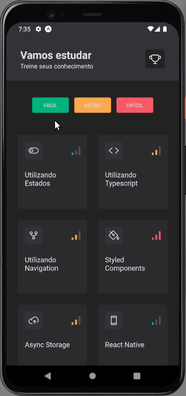
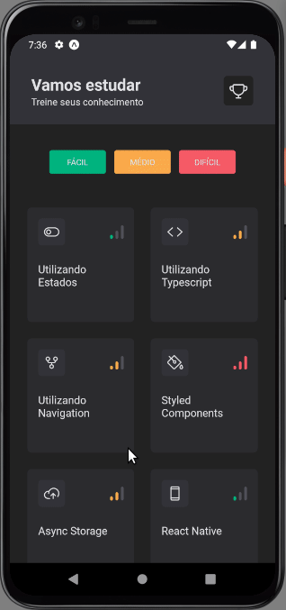

<h1 align="center">
    <p>Ignite Quiz<p>
</h1>

## Demos


 

<br />

---

## About 
 
**Ignite quiz** is a project devloped in rocketseat classes.

In this app i've learned how to animate components with React Native Reanimated, React Native Gesture Handler, React Native Skia and add sound, tactile feedback with Expo AV and Expo Haptics.

<br />

---

## Tools learned in this class

- [React Native Reanimated](https://docs.expo.dev/versions/latest/sdk/reanimated/?utm_source=google&utm_medium=cpc&utm_content=performancemax&gclid=Cj0KCQjwr82iBhCuARIsAO0EAZyEKgGmpUD_hukugkhmZOB6JsClJf_4L-eGnGrMwSemcaIb14L6KmwaAlxAEALw_wcB)
- [React Native Gesture Handler](https://docs.swmansion.com/react-native-gesture-handler/docs/)
- [React Native Skia](https://docs.expo.dev/versions/latest/sdk/skia/)
- [Expo SVG](https://docs.expo.dev/versions/latest/sdk/svg/?utm_source=google&utm_medium=cpc&utm_content=performancemax&gclid=Cj0KCQjwr82iBhCuARIsAO0EAZzX2_nIv6Oclz0ka5LGc0LtHI5piIf4L5jggxtYT_-DROD2g7r7U2YaAvVkEALw_wcB)
- [SVG transformer](https://github.com/kristerkari/react-native-svg-transformer)
- [Expo AV](https://docs.expo.dev/versions/latest/sdk/av/?utm_source=google&utm_medium=cpc&utm_content=performancemax&gclid=Cj0KCQjwr82iBhCuARIsAO0EAZyIU_kToFl_GcLqubRQsBJoa9LPigcQvTXnzp9pAOLZgFrVeIRPYA0aAqNfEALw_wcB)
- [Expo Haptics](https://docs.expo.dev/versions/latest/sdk/haptics/?utm_source=google&utm_medium=cpc&utm_content=performancemax&gclid=Cj0KCQjwr82iBhCuARIsAO0EAZz3A6gh9A0VBn5ASUYZKl0UjgOpyOR3Q2l9MiHXwPY0smVLLWohESwaAn4WEALw_wcB)

<br />

---

## If you wanna try

<br />


```bash
    # Clone or Download Mobile Repository 
    $ git clone https://github.com/Renatoogata/React-Native-Aula05-Ignitequiz
``` 

```bash
    # Install the dependencies
    $ npm install
```

```bash
    # Run Prebuild
    $ npx expo start
```